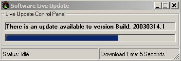



## Live Update

### Description

This program lets you download an updated version of your .exe programs or other parts of your software from the INTERNET or a Local FILE SERVER. I am using the WinInet.DLL to do the actual file transfers. Special thanks to Blake for inspiring this code. http://www.planet-source-code.com/vb/scripts/ShowCode.asp?txtCodeId=13413&lngWId=1
 
### More Info
 
You must adjust the liveu.ini code to reflect the path destination, and fileserver sourcer and/or a URL source

My current issue is that I am using the WinInet.dll instead of the traditional INET.ocx because I found that sometimes it doesn' close completely or take a long time and part of the downloaded files can stay in the buffer. By using the WinInet.dll I now suffer no screen updates while the file is downloaded, as I need to maybe class this out to an ActiveX.dll to allow asynchronous processing, maybe in version 2?

             |
---                |---
**Submitted On**   |2003-03-19 16:47:46
**By**             |[Francisco H Tapia](https://github.com/Planet-Source-Code/PSCIndex/blob/master/ByAuthor/francisco-h-tapia.md)
**Level**          |Advanced
**User Rating**    |5.0 (30 globes from 6 users)
**Compatibility**  |VB 5\.0, VB 6\.0
**Category**       |[Complete Applications](https://github.com/Planet-Source-Code/PSCIndex/blob/master/ByCategory/complete-applications__1-27.md)
**World**          |[Visual Basic](https://github.com/Planet-Source-Code/PSCIndex/blob/master/ByWorld/visual-basic.md)
**Archive File**   |[Live\_Updat1561853192003\.zip](https://github.com/Planet-Source-Code/francisco-h-tapia-live-update__1-44005/archive/master.zip)

### API Declarations

WinInet.DLL for file downloading and checking for an internet connection

